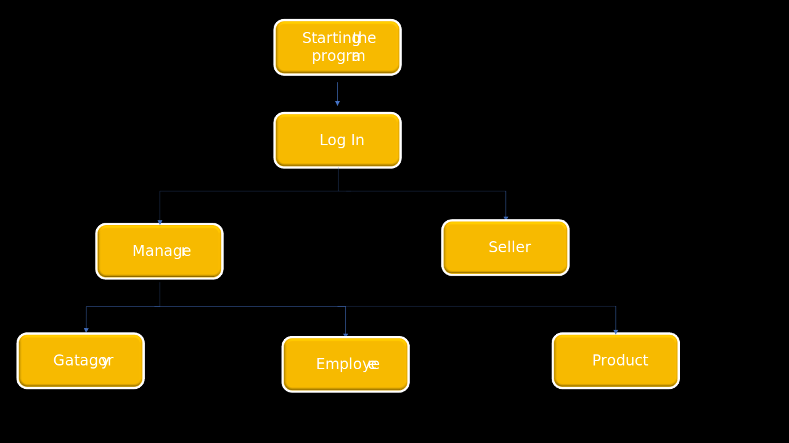

# Grocery Strore

## Simple Description
A Grocery Management System where System is created for a supermarket.the System has two Levels required by the client (Manager & seller).Each of the users has its functionalite.THE Manager is only one person . the Sellar can be added by the manager .The manager can add new Groceries category. The Groceries are divided into various Categories like Fruits, Vegetables, Chocolates, etc. A seller can select a particular item to view the details, choose the number for the customer  that would like to order , and fill in the bill finally the Seller can print it and give it to the customer. 

## Is For Who?
this project is for :
  1. Small market 
  2. Medium  Market 

## What is Required ?
### For the Hardware  
#### it can work in those Devices
 - All in one Pc
 - A Desktop    
 ### For the software  
 #### Operating System 
  - Windows  8 & 10

That  requirement depends on the request of the client also experience of the developer  to give the most suitable system  with respect of the budget of the client.  

## Team
- Ahmed Helal    
responsible for Building and Designing the project.

- Sarok Ali      
responsible for Building and Designing the project.

- Hana Mohammad    
responsible for Building and Designing the project.

## Goals
  1. more productive 
  2. serving the customer faster
  3. having  a selling list for data
  4. more Secure 
  5. need fewer employees(Counter, money manager)

## Content Structure 

The content is will be in the same in the below Diagram architecture :

## Functionality 
Because the project has two levels (manager & Seller) the functionality of each one is different and in order to separate their  functionality we need to log in:
1. LOG IN 
   - ADD ID
   - ADD PASSWORD  
   - change the type of  log in (Manager & Seller)
  
2. Manager 
   - Gatagory
       - ADD new catagory 
       - ADD CATID for each catagory
       - ADD a description
   - Employee
       - ADD EID  for each seller 
       - ADD PASSWORD 
       - ADD the full name 
       - ADD contact 
       - ADD address 
       - DELETE Seller
       - SEARCH for Employee
    - Product
       - ADD PID  for each Product 
       - ADD ProductName
       - ADD the catagory
       - ADD Quantity
       - ADD the Price  
       - EDITING Product 
       - DELETE Product    
 3. Seller    
    - ADD item
    - ADD Quantity of the item 
    - DELETE ITEM 
    - PRINT bill 
    - SEARCH for Item 

## Accessibility(ally)
this system is accessible only for the  Manager and the Seller because it is not an online Grocery System but it will send the history of the sale of each week to the manager by internet.
 - Manager 
 - Seller
 ## Ongoing  Support / maintenance  
 This project is will be done by the team and will be seeing by us till 3 month on market if only need maintaining a problems but the support for adding new feature  in the future it will add new budget depend on the requirement and the time: 

  [  x  ] Same team 

  [   ] another team

## Milestone & Deadline 
this project is requested by L.polla Fattah the period is 23 Weeks 
every week it will cover a request from him and every 2 weeks will review the last and add the new request to the system.

### Phase 
In this project, we use the V-model because we need to consistently keep track of the detail and verify the step.

the phase strat with gathering requirements .then Design, and planning for the system .after that will start coding the project. Then the testing phase for our project but depends on the deadline. Finally the deployment of our project.

## The Tool and Program used:
The Programing language used is :
- java

The Tool used is :
- Intellij Idea
- Neatbean
- Github 

## To contact us the link below
-  [Ahemd  Helal ](mailto:gimal@gmail.com?subject=[GitHub] Source Han Sans)
-  [Sarok  Ali ](mailto:gimal@gmail.com?subject=[GitHub] Source Han Sans)
-  [Hana mohammad ](mailto:gimal@gmail.com?subject=[GitHub] Source Han Sans)
